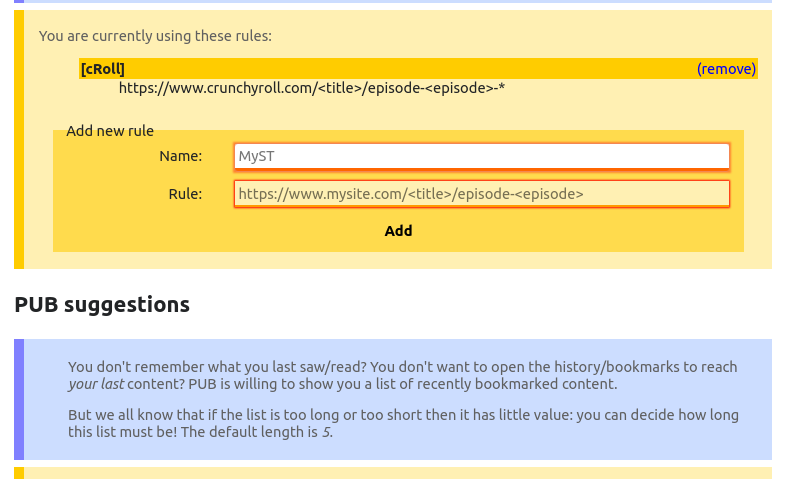

# Progressive Url Bookmarks

A simple firefox extension that helps keeping track of progressive url (e.g., series, lessons).
It does not require any login or any communication with any server: it just manages *your* bookmarks in a smart way.

The main goal is to be able to bookmark a progressive url and automatically delete any previous bookmark of the same content but with a preceding progressive number.
> **Example**
> You are watching the series TheSeries1 at my.streaming.site. You are at episode 4 and you saved in your bookmarks the url my.streaming.site/TheSeries1/episode4 corresponding to this last viewed episode. 
> Then you watch 2 more episodes and you then bookmark the url for episode 6.
> By bookmarking this url with this extension, in your bookmark there will be only the bookmark for episode 6 because the extension deleted the bookmark of episode 4 since it is no more useful. And this is done by only adding a new bookmark: there is no need to manually search and delete the previous bookmark!

## Features

  * **manage its own bookmarks**: no need to backup previous bookmarks since they will never be touched
  * **import bookmarks at any time**: duplicated PUB bookmarks will be filtered at import time, *the list of the progessive bookmark is always tidy and up-to-date*
  * **custom rules**: teach PUB how to understand the urls, be smart and PUB will do all the rest
  * **one entry for each content**: if you are using several sites that offer the same progressive content, there will be only one bookmark per content independently from which site has been used to bookmark the content
  * **list of latest bookmarked content**: links to quickly open your bookmarked content
  * **open one content with another rule**: best effort to quickly switch among several sites, not guaranteed to work tough :)
  * **everything is local**: [all data are yours](#Security)

## User interface

### Popup

* clearly show the content name, progression number and the name of the matching rule of the current url (if it matches the user-specified rules)
* show if the current url is already bookmarked or not: use a feather icon as a background image
* show if the current url refers to content that is already tracked:
   * use a green background color if the content is already tracked and the current url has a bigger progression number
   * use a red background color if the content is already tracked and the current url has a smaller (or equal) progression number
   * use a yellow background color if the content is not already tracked
* button to add the current url to the tracker (which will automatically removes all previous bookmark of the same content, if any)
* button to un-track the current url and the relative content
* small list of the last tracked content. All entries are in fact links and are clickable (as normal bookmarks are)
* submenu to list all the tracked content. All entries are in fact links and are clickable (as normal bookmarks are)
* submenu "open with rule..." listing the links of the url created by using the rules specified in the configuration of the extension

### Configuration

* specify the name of the dedicated bookmark folders where the extension keeps its bookmark. The default folder is "Progressive Url Bookmarks"
* specify the lenght of the "small list of the last tracked content" in the popup. The default is 5
* add and remove rules to match & extract data from urls. Sample url: `*//my.streaming.site/series/<title>&lang=en/*/episode<episode>`. The matching logic interprets a rule with the following meaning:
   * any explicit character will be an exact match (it is necessary to specify the domain)
   * `*` is a wildcard that matches every character except `/`
   * `<title>` is the placeholder for the content's title. Note that it cannot be directly preceded or followed by `*`. It matches every character except `/`
   * `<episode>` is the placeholder for the content's progression number. Note that it cannot be directly preceded or followed by `*`. It matches every character except `/`
   * the end of the rule is *not* strict, meaning that the matching logic assumes that any character can follow the end of the rule

## Security
* no login
* no data exchange with any server
* every bit of information remains in your computer

## Testing/Debugging

1. create an ad-hoc firefox profile (it should be somewhere near `$HOME/.mozilla/firefox/<hash>.<profile name>/`)
2. install `web-ext` (url ...)
3. to create/add bookmarks: `web-ext run --firefox-profile path/to/profile --keep-profile-changes`
4. to mess with the extension: `web-ext run --firefox-profile path/to/profile` so that you can add/remove bookmarks with the extension without actually removing anything since at the next restart every change will be discarded (aka you won't need to add again a bunch of bookmarks in order to test the extension)
5. there are some tests in the `test` folder. Since I'm lazy and I didn't want to import a js framework, the tests are run by opening the `testpage.html`
